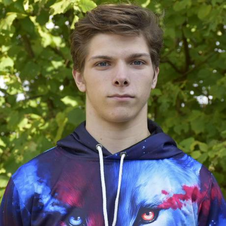

<link href="../style.css" rel="stylesheet"/>
<link href="./about.css" rel="stylesheet"/>

  <md-block>

- <a href="../">Projects</a>
- <a href="#" class="active">About Me</a>

  </md-block>

  <md-block>

# Glenn Dumoulin

  </md-block>
  <h3>Gameplay Programmer</h3>

  

    <section class="general">
      

        <md-block>

# About Me

## My name is Glenn Dumoulin

I was born and raised in Belgium and I'm a **game developer** focussing mostly on **gameplay programming**.

...

        </md-block>
      

      
    </section>
    <section class="edu-hob">
      

        

          <md-block>

## My Education

During my **high school** years I had no idea what kind of study I wanted to do, because nothing really interested me enough to want to delve deeper into it. So I studied **math and sciences**, not knowing how well it would turn out later.

After high school I graduated with a **graduate degree in programming**. However, I wanted something _more interactive and responsive_ than being a **web/app developer**.

This brings us to the present. I am currently studying **Game Development in Digital Arts and Entertainment (DAE) at the Howest University of Applied Sciences**. I had seen this study before but had put aside because I felt like I _lacked the creativity_ to make it in this field. What I didn't think about at the time was of course that **Game Development** is not something you do alone. I enjoyed the programming itself from my previous study and I had a background in math and physics from high school, so I decided to give it a chance and I could not be happier that I did.

          </md-block>
        

        

          <md-block>

## My Hobbies

I like to spend my time doing things like:

- Dancing
- Playing games & board games
- Spending time with friends & family

And I should also mention programming, but I'd rather do some of the other things mentioned above and keep programming _mainly_ for professional use.

In the past I've had quite a few other hobbies such as:

- Judo
- Youth theater
- Djembé

Some of these I did longer than others but I always enjoyed all of them as long as I still did them.

          </md-block>
        

      

    </section>
  

  <section class="platforms">
    <md-block>

## Other Platforms

    </md-block>
    

    

  </section>

<footer>
  <md-block>

©2024 by Glenn Dumoulin. Made with GitHub Pages

  </md-block>
</footer>
