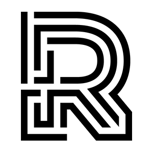
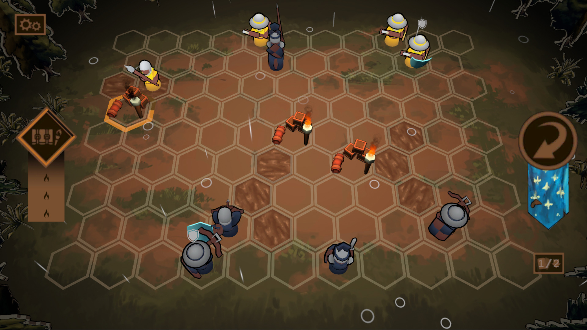
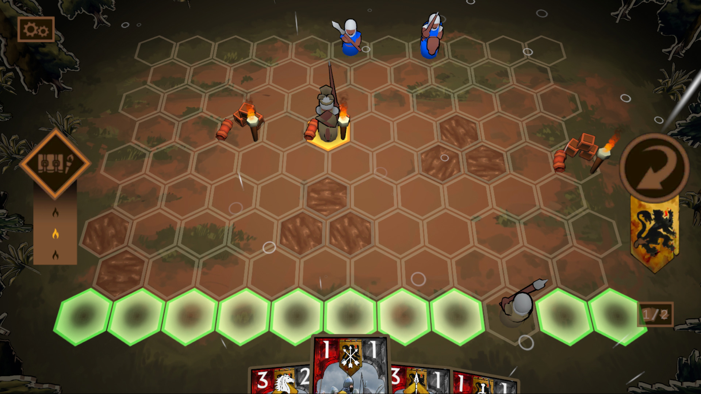
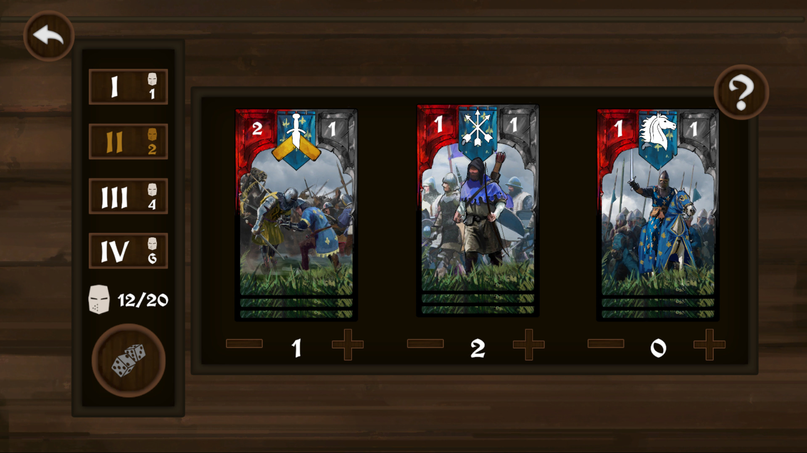
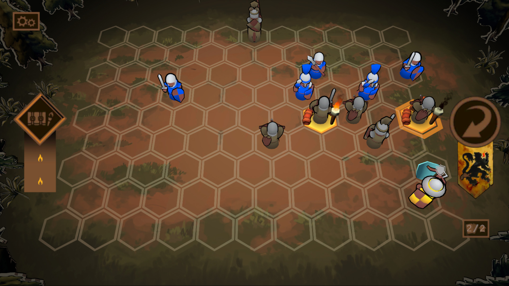
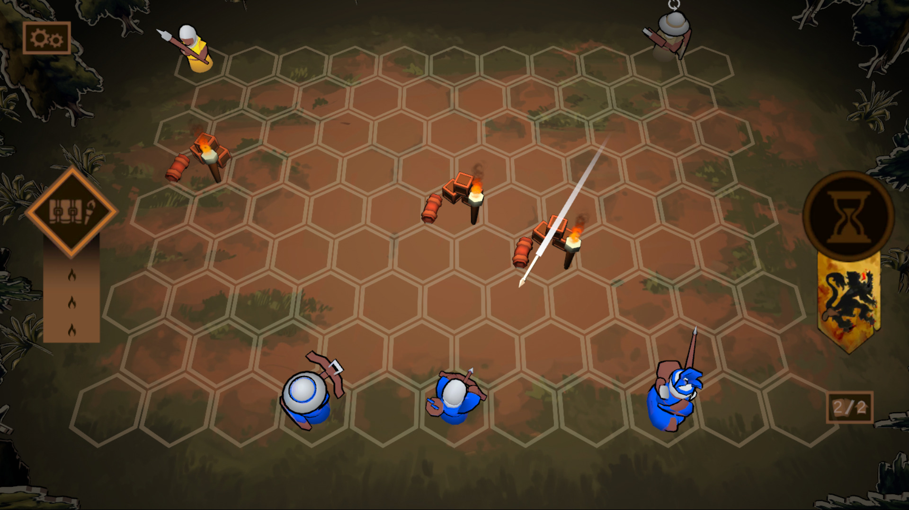
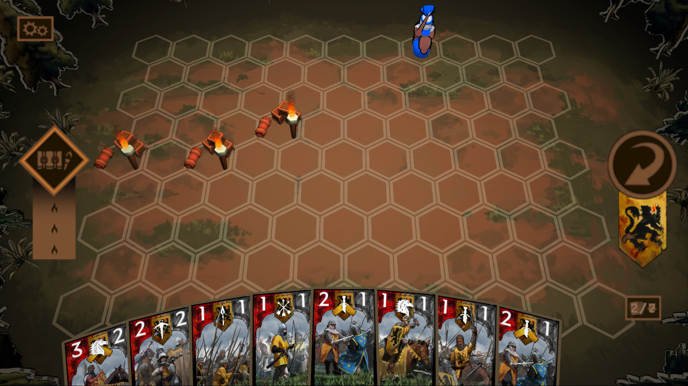
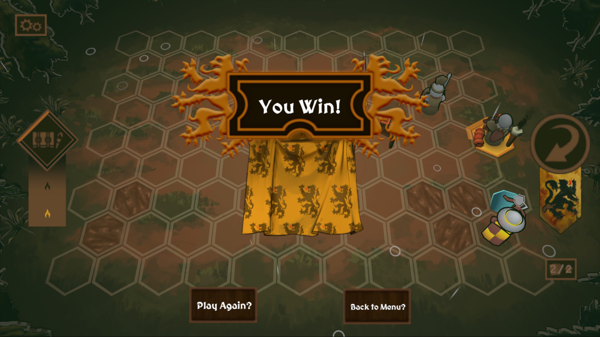
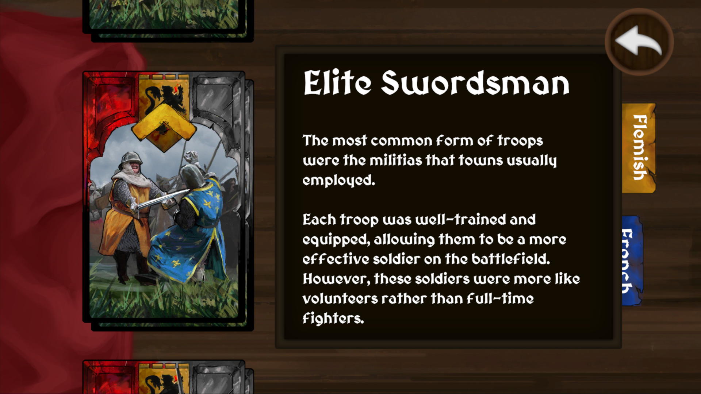
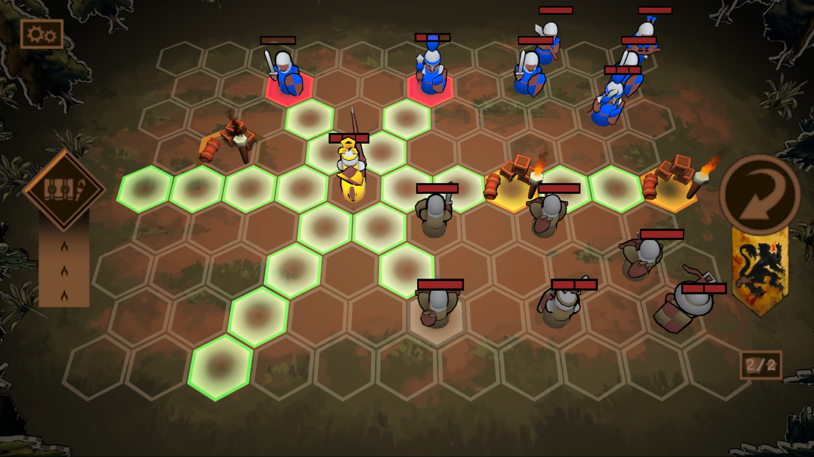

<link href="../../style.css" rel="stylesheet"/>
<link href="../project-details.css" rel="stylesheet"/>

  <md-block>

- <a href="../../">Projects</a>
- <a href="../../About/">About Me</a>

  </md-block>

  <md-block>

# Glenn Dumoulin

  </md-block>
  <h3>Gameplay Programmer</h3>

  <h1 class="project-title">1302 (Mobile)Made in Unity</h1>
  

    <md-block>

### 1302 is a deckbuilding tabletop turn-based strategy game, where the player must carefully build their army and command their troops to defeat their opponent's army.

### Before each match, the player must build their army from a selection of troops. Once in battle, the player must deploy their troops and command where each troop moves and who to attack while adapating to the opponent's moves.

    </md-block>
    <iframe src="https://www.youtube.com/embed/btz0gFXwdrY?si=jl2hYoxJR_N9AMq7" title="YouTube video player" frameborder="0" allow="accelerometer; autoplay; clipboard-write; encrypted-media; gyroscope; picture-in-picture; web-share" referrerpolicy="strict-origin-when-cross-origin" allowfullscreen></iframe>
  

  

    

      <md-block>

## What I did on this project

- Prototyping in Unity
- Gameplay Programming (deck functionality, troop deployment)
- AI Programming (mostly based on chances to do or avoid something)
- Implemented level preset save/loading system for tutorial
- Created the tutorial levels

      </md-block>
    

    

      <md-block>

## What I learned from this project

- Working for a client, in this case the 1302 museum in Kortrijk
- Developing, testing and debugging a mobile game (Android only)

      </md-block>
    

  

  

    <md-block>

## More about this project

    </md-block>
    

      
    

  

  

    <md-block>

## Gallery

    </md-block>
    

      
      
      
      
      
      
      
      
      
      
    

  

<footer>
  <md-block>

©2024 by Glenn Dumoulin. Made with GitHub Pages

  </md-block>
</footer>
