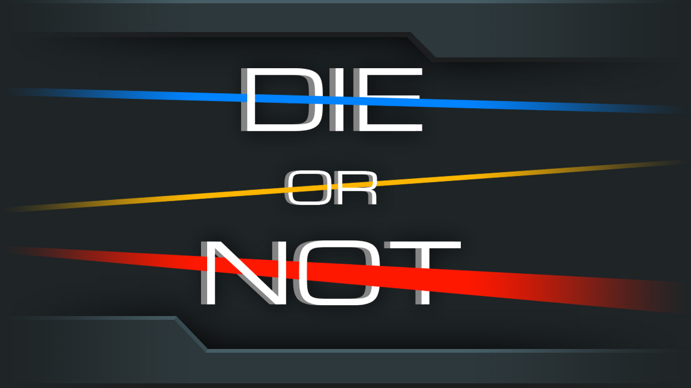
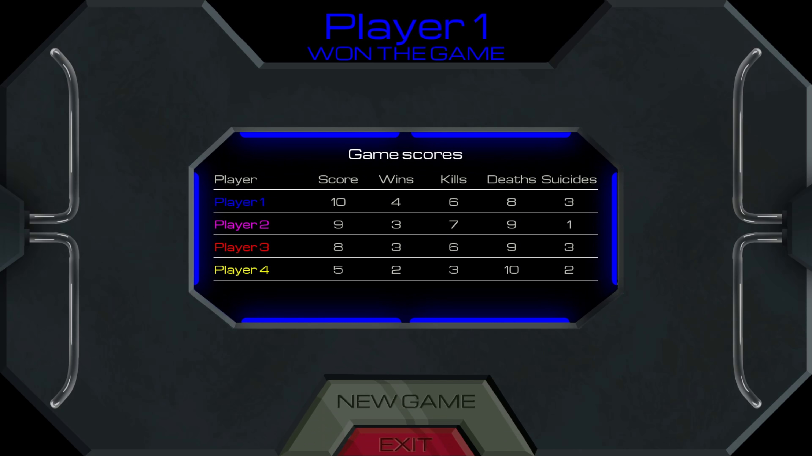

<link href="../../style.css" rel="stylesheet"/>
<link href="../project-details.css" rel="stylesheet"/>

  <md-block>

- <a href="../../">Projects</a>
- <a href="../../About/">About Me</a>

  </md-block>

  <md-block>

# Glenn Dumoulin

  </md-block>
  <h3>Gameplay Programmer</h3>

  <h1 class="project-title">Die or NotMade in UE5</h1>
  

    <md-block>

### Die or Not is a local 2D PvP game, in which two to four (2-4) players play rounds on the same screen until someone reaches the target score.

    </md-block>
    
  

  

    

      <md-block>

## What I did on this project

- Prototyping in Unity and UE5
- Gameplay Programming (parrying, dashing, bullet redirecting, power bounces)
- Implemented most of the powerups, using Unreal's Gameplay Ability System
- Implemented haptic feedback
- UI Programming (round start)

      </md-block>
    

    

      <md-block>

## What I learned from this project

- Working with Unreal C++
- Working in a group for a longer period of time
- Going through the process of creating a vertical slice of a game

      </md-block>
    

  

  

    <md-block>

## More about this project

    </md-block>
    

      
      
    

  

  

    <md-block>

## Gallery

    </md-block>
    

      
      
      
      
      
      
      
      
    

  

<footer>
  <md-block>

©2024 by Glenn Dumoulin. Made with GitHub Pages

  </md-block>
</footer>
