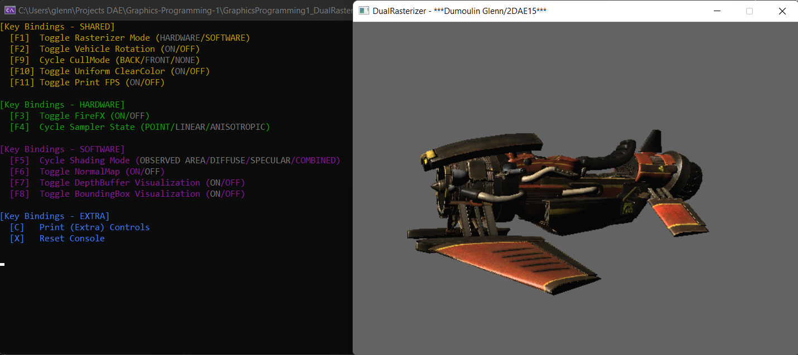

<link href="../../style.css" rel="stylesheet"/>
<link href="../project-details.css" rel="stylesheet"/>

  <md-block>

- <a href="../../">Projects</a>
- <a href="../../About/">About Me</a>
- <a href="../../Resume/">Resume</a>

  </md-block>

  <md-block>

# Glenn Dumoulin

### Gameplay Programmer

#### _"I want to become a gameplay programmer because of the variation the job offers and the close involvement with the content and features of the projects."_

  </md-block>

  <h1 class="project-title">Dual RasterizerMade in C++</h1>
  

    <md-block>

### This project is a rasterizer that can switch between DirectX and a self-made CPU version. Both rasterizers use the same model data to have seamless transitions.

    </md-block>
    
  

  

    

      <md-block>

## Hardware Features

- Diffuse textures with support for opacity
- Different sampler states:
  - Linear
  - Point
  - Anisotropic

      </md-block>
    

    

      <md-block>

## Software Features

- Toggle shading mode:
  - Combined (Specular, normal map and gloss included)
  - Observed area only
  - Diffuse only
  - Specular only
- Toggle normal map
- Toggle depth buffer visualization
- Toggle bounding boxes visualization

      </md-block>
    

    

      <md-block>

## Shared Features

- Load and render meshes with diffuse texture
- Movable camera
- Toggle rasterizer mode (DirectX <--> CPU)
- Cycle cull mode:
  - Back
  - Front
  - None

      </md-block>
    

  

  

    <md-block>

## More about this project

    </md-block>
    

      
    

  

  

    <md-block>

## Gallery

    </md-block>
    

      
      
    

  

<footer>
  <md-block>

©2025 by Glenn Dumoulin. Made with GitHub Pages

  </md-block>
</footer>
