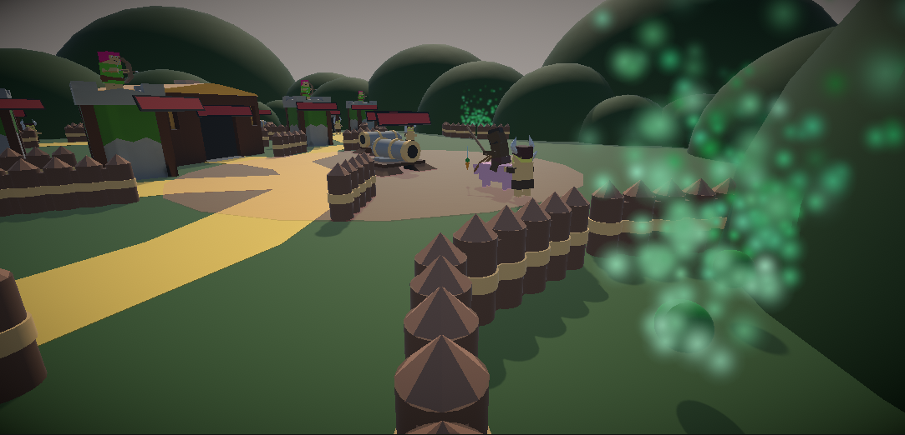
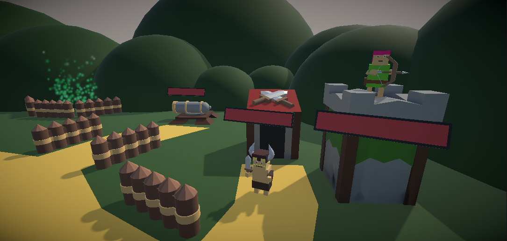
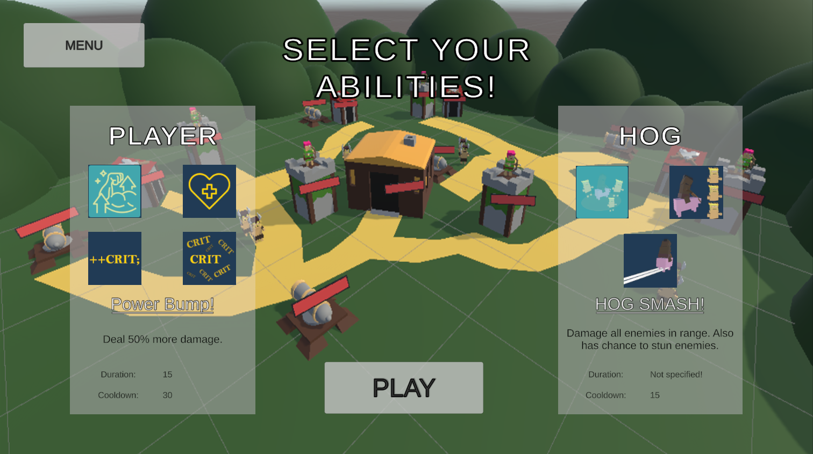
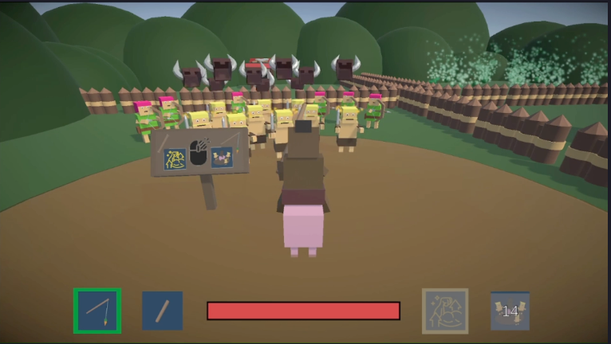

<link href="../../style.css" rel="stylesheet"/>
<link href="../project-details.css" rel="stylesheet"/>

  <md-block>

- <a href="../../">Projects</a>
- <a href="../../About/">About Me</a>
- <a href="../../Resume/">Resume</a>

  </md-block>

  <md-block>

# Glenn Dumoulin

  </md-block>
  <h3>Gameplay Programmer</h3>

  <h1 class="project-title">HogRaiderMade in Unity</h1>
  

    <md-block>

### HogRaider is a third-person combat game. You control your hog to move around a village and you can throw a stick to destroy all buildings with your main goal being to destroy the Town Hall. Before each game you can select 2 skills, one for the yourself and one for the hog. Carefull though, the villagers don't really like it that you destroy their home.

#### _DISCLAIMER: The designs are copied from the popular mobile game, Clash of Clans by Supercell. I do not own any of these designs nor am I selling or distibuting this game._

    </md-block>
    <iframe src="https://www.youtube.com/embed/Epbfi7S1Apk?si=zzccKGTptc3XYMzt" title="YouTube video player" frameborder="0" allow="accelerometer; autoplay; clipboard-write; encrypted-media; gyroscope; picture-in-picture; web-share" referrerpolicy="strict-origin-when-cross-origin" allowfullscreen></iframe>
  

  

    

      <md-block>

## Goal of this project

For this school project every student got two keywords and had to make a game using them in any way we saw fit. My keywords were "variable" and "carrot and stick".

I decided to use "carrot and stick" literally as a usuable item. It gives the player the ability to control the hog they are riding, similar to the item in Minecraft by Mojang to control pigs.

For the "variable" keyword I went with giving the player two skills, one for the player and the other for the hog. At the start of the game the player can choose one skill in each group making the game play a bit different depending on the combo they pick.

      </md-block>
    

    

      <md-block>

## What I learned from this project

- Working with Unity
- Basic game designing
- That I should stick with the programming part of Game Development 😅

      </md-block>
    

  

  

    <md-block>

## More about this project

    </md-block>
    

      
    

  

  

    <md-block>

## Gallery

    </md-block>
    

      
      
      
      
      
    

  

<footer>
  <md-block>

©2024 by Glenn Dumoulin. Made with GitHub Pages

  </md-block>
</footer>
