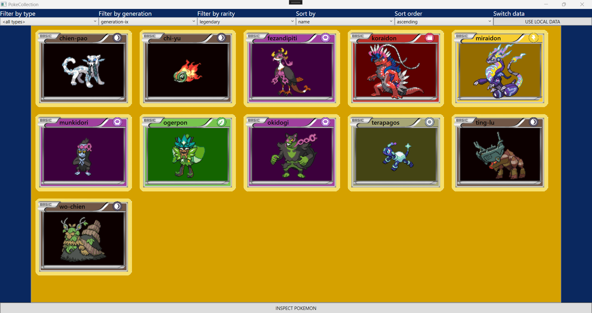
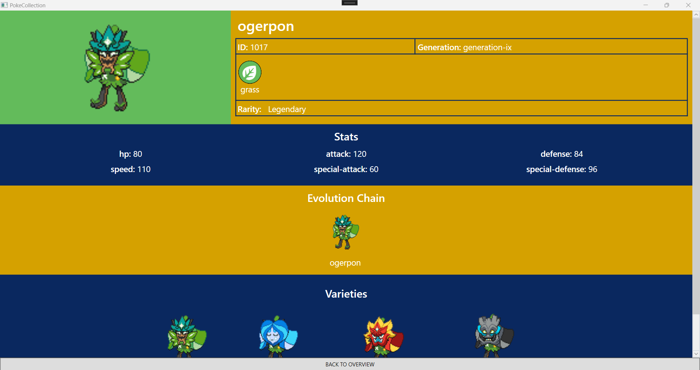
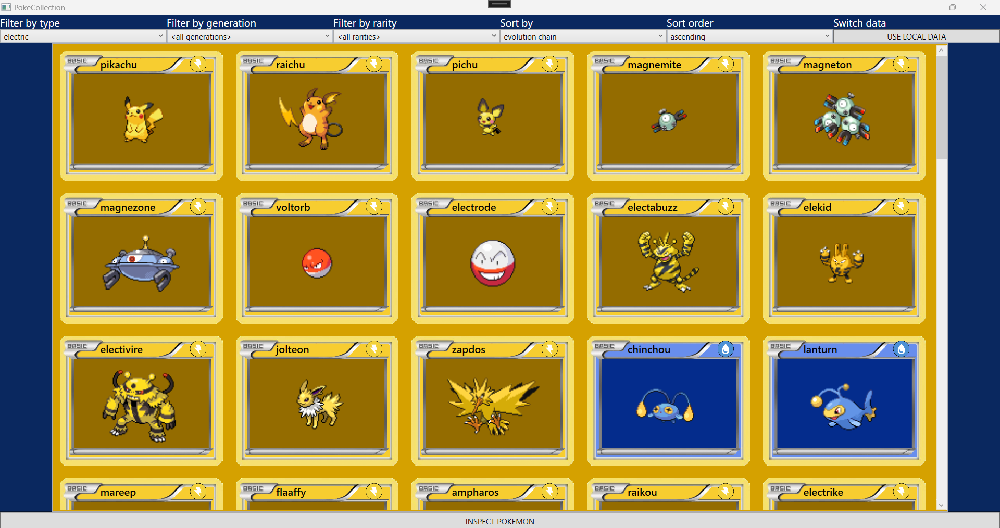
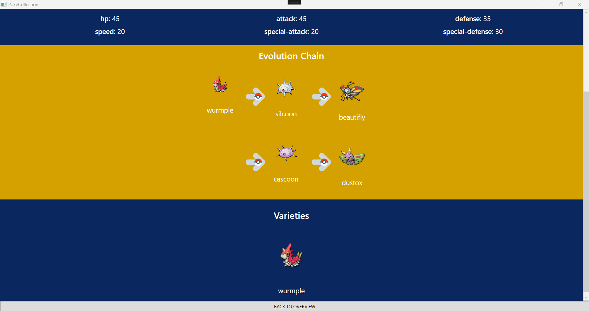
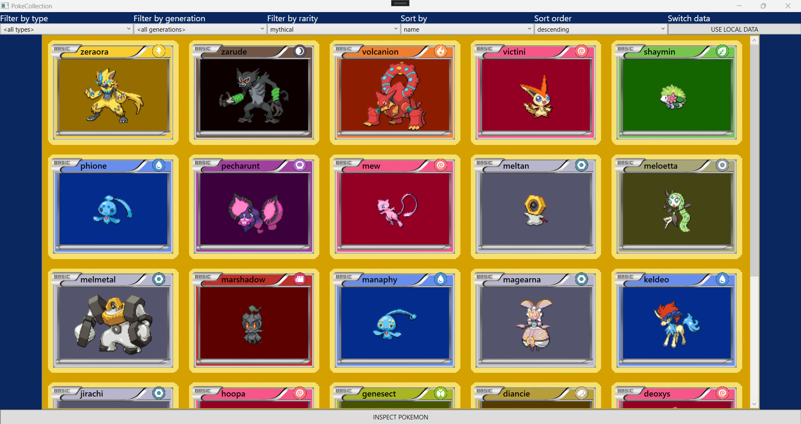

<link href="../../style.css" rel="stylesheet"/>
<link href="../project-details.css" rel="stylesheet"/>

  <md-block>

- <a href="../../">Projects</a>
- <a href="../../About/">About Me</a>
- <a href="../../Resume/">Resume</a>

  </md-block>

  <md-block>

# Glenn Dumoulin

  </md-block>
  <h3>Gameplay Programmer</h3>

  <h1 class="project-title">PokéCollectionMade in C#</h1>
  

    <md-block>

### PokéCollection is a small "Tool" project made in XAML with WPF .NET. In this project you can view an overview of all Pokémon or details from the currently selected one. In the overview you can also filter the Pokémon based on type, generation and rarity and sort them based on id, name or evolution chain (ascending or descending).

### All the data used in this project is loaded from <a href="https://pokeapi.co/" target="_blank">PokéAPI</a>

    </md-block>
    
  

  

    

      <md-block>

## Goal of this project

The purpose of this project was to get a basic introduction to using **XAML with WPF .NET** for **Tool Development**.

      </md-block>
    

    

      <md-block>

## What I learned from this project

- Using XAML with WPF .NET
- Using MVVM (Model, View, ViewModel)
- Working with API's

      </md-block>
    

  

  

    <md-block>

## More about this project

    </md-block>
    

      
    

  

  

    <md-block>

## Gallery

    </md-block>
    

      
      
      
      
      
      
    

  

<footer>
  <md-block>

©2024 by Glenn Dumoulin. Made with GitHub Pages

  </md-block>
</footer>
