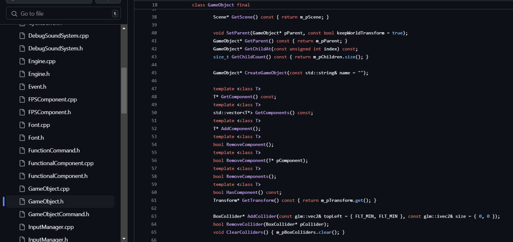

<link href="../../style.css" rel="stylesheet"/>
<link href="../project-details.css" rel="stylesheet"/>

  <md-block>

- <a href="../../">Projects</a>
- <a href="../../About/">About Me</a>
- <a href="../../Resume/">Resume</a>

  </md-block>

  <md-block>

# Glenn Dumoulin

  </md-block>
  <h3>Gameplay Programmer</h3>

  <h1 class="project-title">SGAM EngineMade in C++</h1>
  

    <md-block>

### SGAM Engine is a 2D Component-Based Game Engine made by me, Glenn Dumoulin. I made this project for the Programming 4 Game Development course in Digital Arts and Entertainment (DAE) at Howest, Kortrijk.

### The goal of this project was to make a basic **2D Game Engine** whilst making use of a number of popular **Programming Patterns**.

    </md-block>
    
  

  

    

      <md-block>

## Engine Features

- GameObjects/Components
- Texture rendering
- Box collisions
- Scene management
- Resource management
- Subjects/Observers
- Keyboard & Controller inputs handled by Commands
- Sound Effects
- ImGui rendering

      </md-block>
    

    

      <md-block>

## Programming Patterns

- Game Loop
- Update Method
- Component
- Dirty Flag
- Command
- Observer
- Singleton
- Service Locator
- State

      </md-block>
    

    

      <md-block>

## Techniques & Idioms

- pImpl
- CyclicBuffer
- Multithreading

      </md-block>
    

    

      <md-block>

## Choices

In this part I will try to explain some of the choices I made. But before I begin I would like to clarify that everything that is part of the engine project itself is placed within the `sgam` namespace.

### Box Collisions

I decided to create my own Box Collisions since the egine is extremely basic and only uses squares and rectangles. So adding a library such as Box2D would, in my opinion, be overkill. What I still want to add in this part is the ability to set a collider's Layer and also the ability to set IgnoreLayers in the PhysicsManager.

### SDL SoundSystem

For the implementation of the SDL SoundSystem I opted for using a CyclicBuffer for the SoundRequests. This way I can limit the amount of requests that are waiting to be handled and reuse already allocated memory upon creating the SoundSystem. This SoundSystem also holds it's own thread which sleeps until it's notified that a request has been made.

### Level Loading

For the loading of the levels I wanted to use json files since they are easily editable. I used a third party library called `nlohmann/json` to read the json files and serialize the data into my code types. [nlohmann/json documentation](https://json.nlohmann.me/)

Of course using json files also means that users could easily change the files as well, which is in most cases something we don't want. To avoid this I could use json files during developing/debugging and use binary files for the release versions.

### Functional & Renderable Components

I decided to completely split Functional & Renderable Components apart to enforce a Component only has 1 purpose, it either *does* something or *render* something. Both types have their own virtual methods that can be overriden. For Functional Components these are: `FixedUpdate()`, `Update()` & `LateUpdate()` and for Renderable Components this is `Render()`. The only method that all Components can override is `RenderGUI()`.

### Game Loop

For the Game loop I decided to base my implementation on the one **Unity** uses. [Unity - Order of Execution](https://docs.unity3d.com/Manual/ExecutionOrder.html)

My Game loop looks like this:
1. `Time.Update()`
2. `SceneManager.LoadNextScene()`, If needed
3. `InputManager.ProcessInputs()`
4. `PhysicsManager.Update()`, Box Collisions
5. `SceneManager.FixedUpdate()`, Can happen multiple times in the same frame to catch up on lag
6. `SceneManager.Update()`
7. `SceneManager.LateUpdate()`
8. `SceneManager.Cleanup()`
9. `Renderer.Render()`
10. `Sleep()`, Caps FPS to desiredFPS set in the TimeManager

### Time Class

And lastly for the Time Class I decided to make use of a Singleton. Simply because the alternative of using Dependency Injection everywhere I would need it, seemed like it would be to much work and not very user-friendly. Instead with the Singleton the user can just `#include "SGAMTime.h"` and use `sgam::Time::GetInstance().Delta()` for example.

      </md-block>
    

  

  

    <md-block>

## More about this project

    </md-block>
    

      
    

  

  

<footer>
  <md-block>

©2024 by Glenn Dumoulin. Made with GitHub Pages

  </md-block>
</footer>
