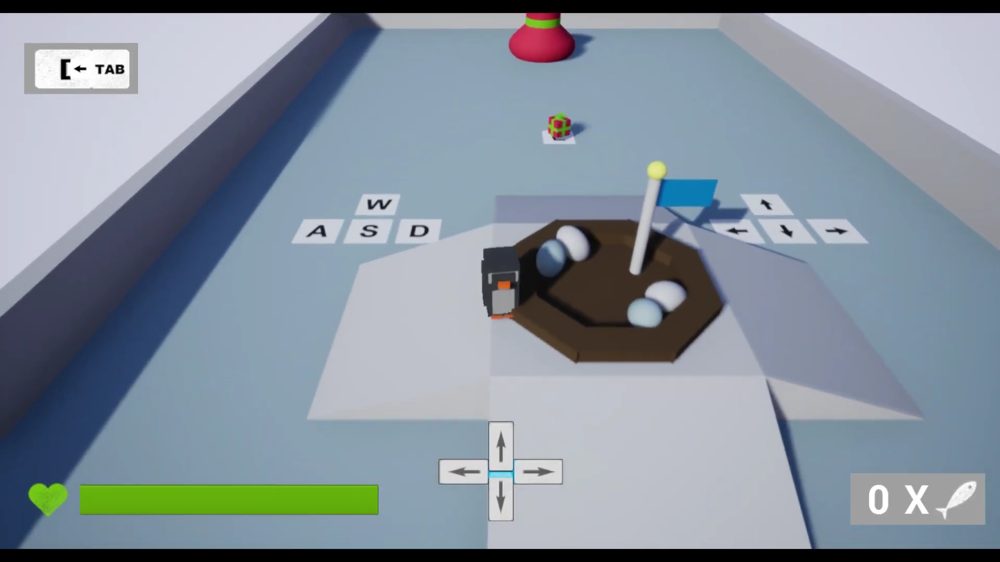

<link href="../../style.css" rel="stylesheet"/>
<link href="../project-details.css" rel="stylesheet"/>

  <md-block>

- <a href="../../">Projects</a>
- <a href="../../About/">About Me</a>
- <a href="../../Resume/">Resume</a>

  </md-block>

  <md-block>

# Glenn Dumoulin

### Gameplay Programmer

#### _"I want to become a gameplay programmer because of the variation the job offers and the close involvement with the content and features of the projects."_

  </md-block>

  <h1 class="project-title">The Lost PresentsMade in UE4</h1>
  

    <md-block>

### The Lost Presents is a puzzle/parcour game where you are a penguin on an icy surface. Our dear Santa seems to have lost all the presents and we have to help get them back.

### Once you're going fast enough you will begin sliding on your belly, which allows you to glide on top of water and to slide underneath barriers. Alternatively we can just use a key to open a door, that also works. There are also other obstacles such as wind turbines, polar foxes and polar bears to avoid.

    </md-block>
    <iframe src="https://www.youtube.com/embed/35-Sj3p9fpE?si=vfDFs0H5dfBxFfoZ" title="YouTube video player" frameborder="0" allow="accelerometer; autoplay; clipboard-write; encrypted-media; gyroscope; picture-in-picture; web-share" referrerpolicy="strict-origin-when-cross-origin" allowfullscreen></iframe>
  

  

    

      <md-block>

## What I learned from this project

- Working with Blueprints in UE4
- Basic game designing
- That I should stick with the programming part of Game Development 😅

      </md-block>
    

  

  

  

    <md-block>

## Gallery

    </md-block>
    

      
      
      
      
      
    

  

<footer>
  <md-block>

©2024 by Glenn Dumoulin. Made with GitHub Pages

  </md-block>
</footer>
