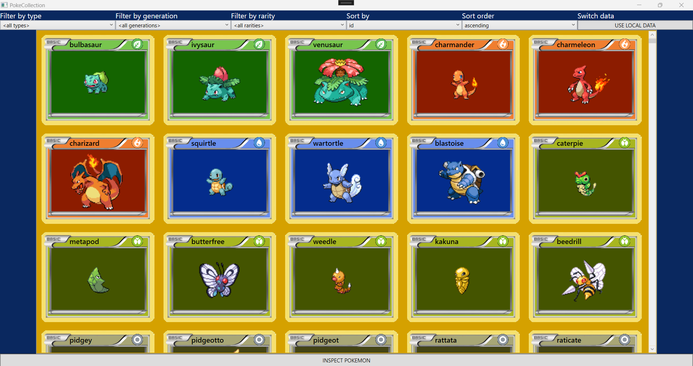
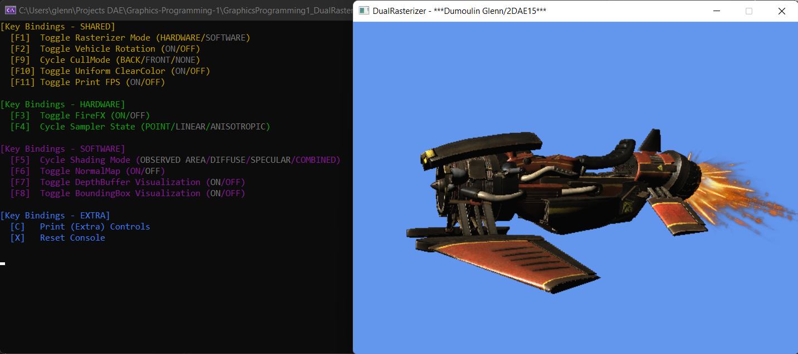

<link href="./style.css" rel="stylesheet"/>
<link href="./experiences.css" rel="stylesheet"/>
<link href="./projects.css" rel="stylesheet"/>

  <md-block>

- <a href="#" class="active">Projects</a>
- <a href="./About/">About Me</a>
- <a href="./Resume/">Resume</a>

  </md-block>

  <md-block>

# Glenn Dumoulin

### Gameplay Programmer

#### _"I want to become a gameplay programmer because of the variation the job offers and the close involvement with the content and features of the projects."_

  </md-block>

  <h2>Work Experience</h2>
  

    

      <md-block>

## Spellware Studios

#### Intern --> Junior Gameplay Programmer _(Feb 2025 - Jan 2026)_

I worked on multiple projects including <a href="https://store.steampowered.com/app/2275010/Ardent_Wilds/" target="_blank">Ardent Wilds</a> and some client projects, which haven't been released yet.

      </md-block>
	  
	

  

  <h2>Game Projects</h2>
  

    <a href="./Projects/DieOrNot/" class="project">
      
      <md-block>

## Die or Not

#### Made in UE5

      </md-block>
      
Group Project | 2023

    </a>
    <a href="./Projects/1302/" class="project">
      
      <md-block>

## 1302 (Mobile)

#### Made in Unity

      </md-block>
      
Group Project | 2024

    </a>
    <a href="./Projects/HogRaider/" class="project">
      
      <md-block>

## HogRaider

#### Made in Unity

      </md-block>
      
Solo Project | 2022

    </a>
    <a href="./Projects/TheLostPresents/" class="project">
      
      <md-block>

## The Lost Presents

#### Made in UE4

      </md-block>
      
Solo Project | 2022

    </a>
  

  <h2>Other Projects</h2>
  

    <a href="./Projects/SGAMEngine/" class="project">
      
      <md-block>

## SGAM Engine

#### Made in C++

      </md-block>
      
Engine Project | 2024

    </a>
    <a href="./Projects/PokeCollection/" class="project">
      
      <md-block>

## PokéCollection

#### Made in C#

      </md-block>
      
Tool Project | 2023

    </a>
    <a href="./Projects/DualRasterizer/" class="project">
      
      <md-block>

## Dual Rasterizer

#### Made in C++

      </md-block>
      
Graphics Project | 2023

    </a>
  

<footer>
  <md-block>

©2025 by Glenn Dumoulin. Made with GitHub Pages

  </md-block>
</footer>
