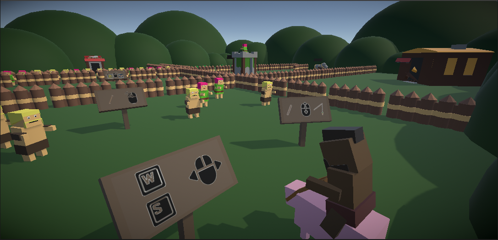

<link href="./style.css" rel="stylesheet"/>
<link href="./projects.css" rel="stylesheet"/>

  <md-block>

- <a href="#" class="active">Projects</a>
- <a href="./About/">About Me</a>

  </md-block>

  <md-block>

# Glenn Dumoulin

  </md-block>
  <h3>Gameplay Programmer</h3>

  <a href="#" class="project">
    
    <md-block>

## Die or Not

#### Made in UE5

    </md-block>
  </a>
  <a href="#" class="project">
    
    <md-block>

## 1302 (mobile)

#### Made in Unity

    </md-block>
  </a>
  <a href="#" class="project">
    
    <md-block>

## HogRaider

#### Made in Unity

    </md-block>
  </a>
  <a href="#" class="project">
    
    <md-block>

## The Lost Presents

#### Made in UE4

    </md-block>
  </a>

<footer>
  <md-block>

©2024 by Glenn Dumoulin. Made with GitHub Pages

  </md-block>
</footer>
